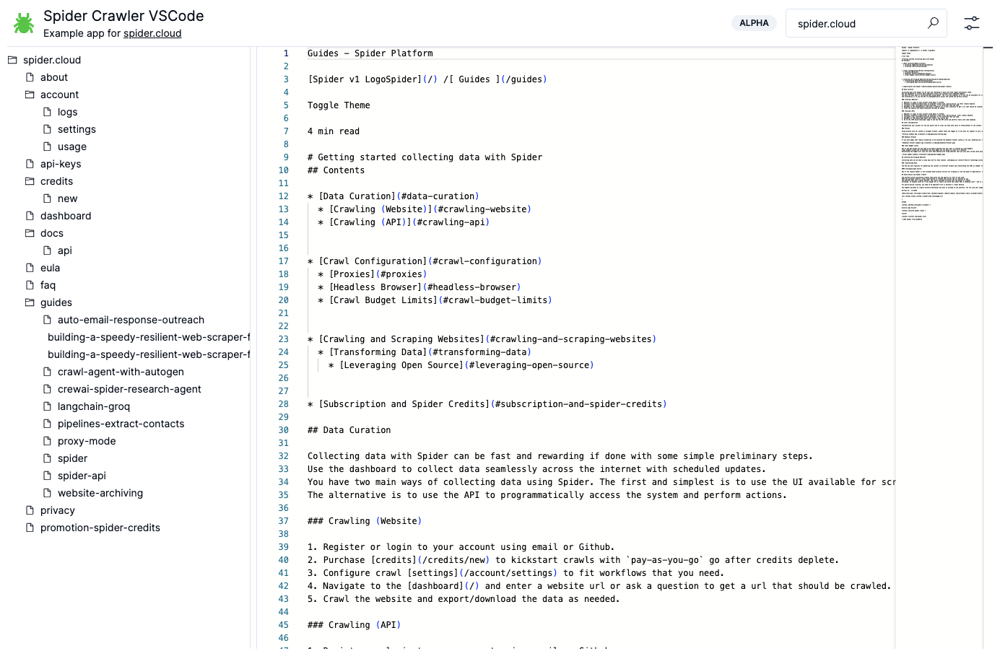

# Spider Archiver

Crawl and archive websites using [spider.cloud](https://spider.cloud). Browse saved pages in a VSCode-like interface with syntax highlighting, a file tree, and resizable panels.

**Live:** [archiver.spider.cloud](https://archiver.spider.cloud)

[](https://vercel.com/new/clone?repository-url=https%3A%2F%2Fgithub.com%2Fspider-rs%2Fspider-cloud-live-code-viewer&env=NEXT_PUBLIC_SUPABASE_URL,NEXT_PUBLIC_SUPABASE_ANON_KEY&project-name=spider-archiver&repository-name=spider-archiver)



## Features

- Stream-crawl websites via the Spider API and view results in real time
- Monaco editor with syntax highlighting for HTML, Markdown, and plain text
- File tree sidebar to navigate crawled pages
- IndexedDB persistence — pages survive page reloads
- Cross-app switcher to jump between all [Spider Cloud](https://spider.cloud) tools with the current URL pre-filled
- Configurable crawl limit, return format (raw / markdown / text), and request mode (HTTP / Chrome / Smart)

## Getting Started

### Prerequisites

- Node.js 18+
- A [spider.cloud](https://spider.cloud) account (free tier available)

### Environment Variables

Create a `.env.local` file:

```env
NEXT_PUBLIC_SUPABASE_URL=<your-supabase-url>
NEXT_PUBLIC_SUPABASE_ANON_KEY=<your-supabase-anon-key>
```

### Development

```bash
npm run dev
# or
yarn dev
# or
pnpm dev
# or
bun dev
```

Open [http://localhost:3001](http://localhost:3001) to see the result.

## Tech Stack

- [Next.js](https://nextjs.org) 14 (App Router)
- [React](https://react.dev) 18
- [Monaco Editor](https://microsoft.github.io/monaco-editor/) via `@monaco-editor/react`
- [Tailwind CSS](https://tailwindcss.com)
- [Radix UI](https://www.radix-ui.com) primitives (Dialog, Select, Toast)
- [Supabase](https://supabase.com) auth
- [Vercel Analytics](https://vercel.com/analytics)

## Related Spider Cloud Tools

| Tool | URL |
|------|-----|
| Archiver | [archiver.spider.cloud](https://archiver.spider.cloud) |
| Dead Link Checker | [dead-link-checker.spider.cloud](https://dead-link-checker.spider.cloud) |
| A11y Checker | [a11y-checker.spider.cloud](https://a11y-checker.spider.cloud) |
| Knowledge Base | [knowledge-base.spider.cloud](https://knowledge-base.spider.cloud) |
| Perf Runner | [perf-runner.spider.cloud](https://perf-runner.spider.cloud) |
| Content Translator | [content-translator.spider.cloud](https://content-translator.spider.cloud) |
| Diff Monitor | [diff-monitor.spider.cloud](https://diff-monitor.spider.cloud) |
| Sitemap Generator | [sitemap-generator.spider.cloud](https://sitemap-generator.spider.cloud) |
| Link Graph | [link-graph.spider.cloud](https://link-graph.spider.cloud) |

## License

This project is licensed under the [MIT license].

[MIT license]: https://github.com/spider-rs/spider-cloud-live-code-viewer/blob/main/LICENSE